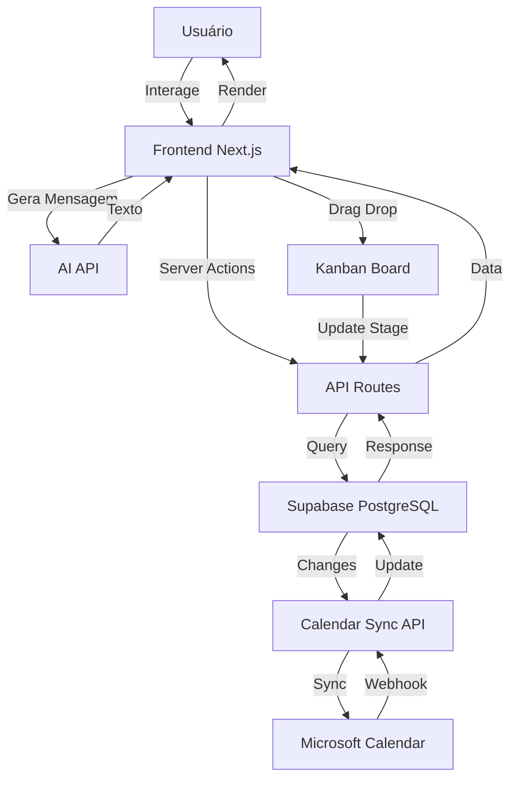

# CRM Kanban Personalizado para Eventos de Corrida - UTMB

## Visão Geral

Sistema de CRM web personalizado inspirado no Pipedrive, focado na gestão de clientes (patrocinadores, parceiros e expositores) de eventos de corrida em trilha. O sistema terá interface kanban customizável, sistema de cotas de patrocínio com contra-partidas editáveis, integração com Microsoft Calendar, geração de mensagens com IA e classificação por setores conforme regulamentação UTMB.

## Arquitetura Técnica

### Stack Principal

- **Frontend**: Next.js 14+ (App Router) com React, TypeScript, Tailwind CSS
- **Backend**: Next.js API Routes + Server Actions
- **Database**: Supabase (PostgreSQL) - cloud hosting
- **Autenticação**: Supabase Auth
- **Calendário**: Microsoft Graph API (sincronização bidirecional)
- **IA**: OpenAI API ou Anthropic Claude API para geração de mensagens
- **UI Components**: shadcn/ui ou Radix UI
- **Estado**: React Query (TanStack Query) + Zustand
- **Drag & Drop**: @dnd-kit/core para kanban
- **Design System**: Paleta de cores pastel "Sunrise Glow"

### Estrutura de Dados

#### Tabelas Principais

- `organizations` - Clientes (patrocinadores, parceiros, expositores)
- `contacts` - Contatos (pessoas) vinculados a organizações
- `deals` - Oportunidades/Negociações vinculadas a organizações
- `pipeline_stages` - Estágios customizáveis do kanban
- `sponsorship_tiers` - Cotas de patrocínio (Title, Partner, Supplier)
- `sponsorship_counterparts` - Contra-partidas por cota
- `deal_counterparts` - Contra-partidas negociadas por deal
- `sectors` - Classificação de setores (Event Requirement, Protected, Restricted, etc)
- `activities` - Histórico de atividades (chamadas, emails, reuniões) com próxima ação
- `deal_documents` - Referências a documentos armazenados no Supabase Storage
- `calendar_events` - Sincronização com Microsoft Calendar
- `ai_messages` - Histórico de mensagens geradas por IA
- `events` - Eventos (Paraty 2025, Paraty 2026, etc)

#### Relacionamentos

```
organizations (1) ──< (N) contacts
organizations (1) ──< (N) deals
events (1) ──< (N) deals
pipeline_stages (1) ──< (N) deals
sponsorship_tiers (1) ──< (N) deals (patrocinadores)
sponsorship_tiers (1) ──< (N) sponsorship_counterparts
deals (1) ──< (N) deal_counterparts
deals (1) ──< (N) activities
deals (1) ──< (N) deal_documents
deals (1) ──< (N) calendar_events
organizations (N) ──< (N) sectors (many-to-many)
```

## Design System - Paleta de Cores "Sunrise Glow"

O projeto utilizará uma paleta de cores pastel suave e acolhedora, evocando um horizonte matinal gentil:

### Cores Principais

- **Peach Glow** (`#FFC09F`): Pêssego suave e brilhante, transmite otimismo e acolhimento
- **Light Gold** (`#FFEE93`): Dourado delicado, evoca sofisticação e alegria celebratória
- **Lemon Chiffon** (`#FCF5C7`): Amarelo pastel etéreo, suave como luz solar através de cortinas
- **Light Blue** (`#A0CED9`): Azul pastel fresco, transmite céus abertos e calma
- **Celadon** (`#ADF7B6`): Verde pastel suave, remete a orvalho em folhas de primavera

### Aplicação das Cores

- **Backgrounds**: Lemon Chiffon e Light Blue para fundos suaves
- **Cards e Componentes**: Peach Glow e Light Gold para elementos interativos
- **Acentos e Destaques**: Celadon para ações positivas e confirmações
- **Estágios do Pipeline**: Cada estágio terá uma cor da paleta atribuída
- **Estágio "Perdido"**: Usará uma variação mais suave de vermelho pastel para manter harmonia

### Configuração Tailwind CSS

```javascript
// tailwind.config.js
theme: {
  extend: {
    colors: {
      'peach-glow': '#FFC09F',
      'light-gold': '#FFEE93',
      'lemon-chiffon': '#FCF5C7',
      'light-blue': '#A0CED9',
      'celadon': '#ADF7B6',
    }
  }
}
```

## Componentes Principais

### 1. Interface Kanban (`app/kanban/page.tsx`)

- Board drag-and-drop com colunas representando estágios
- Cards de deals arrastáveis entre estágios
- Visualização por tipo de cliente e evento (filtros)
- Modal rápido para visualizar/editar deal
- Indicador visual para deals "Perdidos"

### 2. Gestão de Clientes (`app/organizations/page.tsx`)

- Lista de organizações com filtros e busca
- Formulário de cadastro/edição
- Categorização: Patrocinador, Parceiro, Expositor
- Classificação por setores (Event Requirement, Protected, Restricted 1/2, Prohibited, Open)
- Para Parceiros: subcategorias (Pousadas, Restaurantes, Outros)

### 3. Gestão de Deals (`app/deals/[id]/page.tsx`)

- Formulário completo de deal
- Campo obrigatório: Evento (ex: Paraty 2026)
- Para Patrocinadores:
  - Seleção de cota (Title R$1.5MM, Partner R$400K, Supplier R$130K/90K/60K)
  - Editor de contra-partidas baseado na cota selecionada
  - Campo de localização do stand na Expo
- Para Expositores:
  - Campo de localização do stand na Expo
- Para todos:
  - Campo de permuta (produto/serviço)
  - Valor monetário + valor em permuta
- **Gestão de Documentos**: Upload e visualização de documentos vinculados ao deal (Supabase Storage)
- **Atividades**: Histórico de atividades com próxima ação implícita

### 4. Sistema de Cotas (`app/settings/sponsorship-tiers/page.tsx`)

- CRUD de cotas de patrocínio
- Valores padrão:
  - Title: R$ 1.5 MM
  - Partner: R$ 400 Mil
  - Supplier: R$ 130 Mil, R$ 90 Mil, R$ 60 Mil
- Gerenciamento de contra-partidas por cota
- Template baseado em `UTMB 2025 - Tabela de Cotas.pdf`
- Contra-partidas editáveis por deal (pode adicionar/remover/modificar)

### 5. Pipeline Customizável (`app/settings/pipelines/page.tsx`)

- CRUD de estágios do pipeline
- Reordenação de estágios
- Configuração de cores e nomes
- Pipeline padrão inicial (neutro, não comercial):

  1. Lead
  2. Contato iniciado
  3. Proposta enviada
  4. Negociação
  5. Ganhou
  6. Perdido

### 6. Integração Microsoft Calendar (`lib/calendar/microsoft.ts`)

- Sincronização bidirecional com Microsoft Calendar
- Autenticação OAuth 2.0 com Microsoft Graph
- Criação de eventos a partir de deals
- Visualização de eventos no contexto do deal
- Webhook para atualizações do calendário
- Email corporativo: rafael.miranda@utmb.world

### 7. Geração de Mensagens com IA (`app/deals/[id]/ai-messages/page.tsx`)

- Interface para gerar emails/mensagens personalizadas
- Contexto automático: dados do deal, organização, histórico
- Templates pré-definidos (proposta, follow-up, negociação)
- Histórico de mensagens geradas
- Edição manual após geração
- Integração com OpenAI ou Claude API

### 8. Classificação por Setores (`app/settings/sectors/page.tsx`)

- CRUD de setores conforme tabela UTMB:
  - **Event Requirement Categories**: Energy Bars, Energy Candy, Energy Drinks, etc.
  - **Protected Categories (Transitional)**: Compression products, Hand/wrist devices, Headphones, etc.
  - **Restricted 1 Categories**: Eyewear, Coaching application, Travel & accommodation
  - **Restricted 2 Categories**: Automaker, Energy management, Financial services, etc.
  - **Prohibited Categories**: Tobacco, Drugs, Firearms, Gambling, etc.
  - **Open Categories**: Qualquer outro não mencionado
- Associação many-to-many com organizações

## Estrutura de Arquivos

```
utmb-crm/
├── app/
│   ├── (auth)/
│   │   ├── login/
│   │   └── layout.tsx
│   ├── (dashboard)/
│   │   ├── kanban/
│   │   │   ├── page.tsx
│   │   │   └── components/
│   │   │       ├── KanbanBoard.tsx
│   │   │       ├── KanbanColumn.tsx
│   │   │       └── DealCard.tsx
│   │   ├── organizations/
│   │   │   ├── page.tsx
│   │   │   ├── [id]/
│   │   │   │   ├── page.tsx
│   │   │   │   └── contacts/
│   │   │   │       └── page.tsx
│   │   │   └── components/
│   │   │       ├── OrganizationForm.tsx
│   │   │       └── ContactForm.tsx
│   │   ├── deals/
│   │   │   ├── [id]/
│   │   │   │   ├── page.tsx
│   │   │   │   └── ai-messages/
│   │   │   │       └── page.tsx
│   │   │   └── components/
│   │   │       ├── DealDetailModal.tsx
│   │   │       ├── SponsorshipTierSelector.tsx
│   │   │       ├── CounterpartsEditor.tsx
│   │   │       └── StandLocationField.tsx
│   │   ├── events/
│   │   │   ├── page.tsx
│   │   │   └── [id]/
│   │   │       └── page.tsx
│   │   ├── settings/
│   │   │   ├── pipelines/
│   │   │   │   └── page.tsx
│   │   │   ├── sponsorship-tiers/
│   │   │   │   └── page.tsx
│   │   │   └── sectors/
│   │   │       └── page.tsx
│   │   └── layout.tsx
│   ├── api/
│   │   ├── deals/
│   │   │   └── route.ts
│   │   ├── organizations/
│   │   │   └── route.ts
│   │   ├── pipelines/
│   │   │   └── route.ts
│   │   ├── calendar/
│   │   │   └── microsoft/
│   │   │       └── sync/
│   │   │           └── route.ts
│   │   └── ai/
│   │       └── generate-message/
│   │           └── route.ts
│   └── layout.tsx
├── lib/
│   ├── supabase/
│   │   ├── client.ts
│   │   ├── server.ts
│   │   └── storage.ts
│   ├── calendar/
│   │   ├── microsoft-client.ts
│   │   └── sync.ts
│   ├── ai/
│   │   ├── openai-client.ts
│   │   └── message-generator.ts
│   ├── db/
│   │   └── schema.ts
│   └── utils/
├── components/
│   ├── ui/ (shadcn components)
│   └── shared/
├── types/
│   └── index.ts
├── data/
│   └── sponsorship-tiers-default.json
└── supabase/
    └── migrations/
        └── 001_initial_schema.sql
```

## Fluxo de Dados



## Banco de Dados - Schema Detalhado

```sql
-- Eventos
CREATE TABLE events (
  id UUID PRIMARY KEY DEFAULT gen_random_uuid(),
  name TEXT NOT NULL UNIQUE, -- 'Paraty 2025', 'Paraty 2026'
  year INTEGER NOT NULL,
  start_date DATE,
  end_date DATE,
  created_at TIMESTAMPTZ DEFAULT NOW()
);

-- Setores (classificação UTMB)
CREATE TABLE sectors (
  id UUID PRIMARY KEY DEFAULT gen_random_uuid(),
  name TEXT NOT NULL UNIQUE,
  category TEXT NOT NULL CHECK (category IN (
    'event_requirement',
    'protected_transitional',
    'restricted_1',
    'restricted_2',
    'prohibited',
    'open'
  )),
  description TEXT,
  created_at TIMESTAMPTZ DEFAULT NOW()
);

-- Organizações (clientes)
CREATE TABLE organizations (
  id UUID PRIMARY KEY DEFAULT gen_random_uuid(),
  name TEXT NOT NULL,
  type TEXT CHECK (type IN ('patrocinador', 'parceiro', 'expositor')),
  partner_subcategory TEXT CHECK (partner_subcategory IN ('pousada', 'restaurante', 'outro')),
  website TEXT,
  sector_ids UUID[] DEFAULT '{}', -- Array de setores
  created_at TIMESTAMPTZ DEFAULT NOW(),
  updated_at TIMESTAMPTZ DEFAULT NOW()
);

-- Contatos (pessoas)
CREATE TABLE contacts (
  id UUID PRIMARY KEY DEFAULT gen_random_uuid(),
  organization_id UUID REFERENCES organizations(id) ON DELETE CASCADE,
  name TEXT NOT NULL,
  email TEXT,
  phone TEXT,
  position TEXT, -- Cargo
  created_at TIMESTAMPTZ DEFAULT NOW(),
  updated_at TIMESTAMPTZ DEFAULT NOW()
);

-- Cotas de Patrocínio
CREATE TABLE sponsorship_tiers (
  id UUID PRIMARY KEY DEFAULT gen_random_uuid(),
  name TEXT NOT NULL UNIQUE, -- 'Title', 'Partner', 'Supplier'
  value_brl DECIMAL(12,2) NOT NULL,
  description TEXT,
  created_at TIMESTAMPTZ DEFAULT NOW()
);

-- Contra-partidas padrão por cota
CREATE TABLE sponsorship_counterparts (
  id UUID PRIMARY KEY DEFAULT gen_random_uuid(),
  tier_id UUID REFERENCES sponsorship_tiers(id) ON DELETE CASCADE,
  name TEXT NOT NULL, -- 'Nome da prova/Camiseta', 'Gift Finisher', etc.
  included BOOLEAN DEFAULT TRUE,
  details TEXT, -- Descrição detalhada da contra-partida
  created_at TIMESTAMPTZ DEFAULT NOW()
);

-- Estágios do Pipeline
CREATE TABLE pipeline_stages (
  id UUID PRIMARY KEY DEFAULT gen_random_uuid(),
  name TEXT NOT NULL,
  position INTEGER NOT NULL,
  color TEXT DEFAULT '#3B82F6',
  is_lost BOOLEAN DEFAULT FALSE, -- Para estágio "Perdido"
  created_at TIMESTAMPTZ DEFAULT NOW()
);

-- Deals (Oportunidades)
CREATE TABLE deals (
  id UUID PRIMARY KEY DEFAULT gen_random_uuid(),
  title TEXT NOT NULL,
  organization_id UUID REFERENCES organizations(id),
  event_id UUID REFERENCES events(id) NOT NULL,
  stage_id UUID REFERENCES pipeline_stages(id),
  sponsorship_tier_id UUID REFERENCES sponsorship_tiers(id), -- Apenas para patrocinadores
  value_monetary DECIMAL(12,2), -- Valor em dinheiro
  value_barter DECIMAL(12,2), -- Valor em permuta
  currency TEXT DEFAULT 'BRL',
  barter_description TEXT, -- Descrição da permuta (produto/serviço)
  stand_location TEXT, -- Localização do stand (expositores e patrocinadores)
  expected_close_date DATE,
  created_at TIMESTAMPTZ DEFAULT NOW(),
  updated_at TIMESTAMPTZ DEFAULT NOW()
);

-- Contra-partidas negociadas por deal (editáveis)
CREATE TABLE deal_counterparts (
  id UUID PRIMARY KEY DEFAULT gen_random_uuid(),
  deal_id UUID REFERENCES deals(id) ON DELETE CASCADE,
  counterpart_id UUID REFERENCES sponsorship_counterparts(id), -- Referência ao padrão
  name TEXT NOT NULL, -- Pode ser editado
  included BOOLEAN DEFAULT TRUE, -- Pode ser removido
  details TEXT, -- Pode ser modificado
  custom BOOLEAN DEFAULT FALSE, -- Se foi adicionado manualmente
  created_at TIMESTAMPTZ DEFAULT NOW(),
  updated_at TIMESTAMPTZ DEFAULT NOW()
);

-- Atividades
CREATE TABLE activities (
  id UUID PRIMARY KEY DEFAULT gen_random_uuid(),
  deal_id UUID REFERENCES deals(id) ON DELETE CASCADE,
  type TEXT CHECK (type IN ('call', 'email', 'meeting', 'note')),
  description TEXT,
  activity_date TIMESTAMPTZ NOT NULL, -- Data da atividade realizada
  next_action TEXT, -- Próxima ação implícita (ex: "ligar em 10 dias")
  next_action_date TIMESTAMPTZ, -- Data sugerida para próxima ação
  completed BOOLEAN DEFAULT FALSE,
  created_at TIMESTAMPTZ DEFAULT NOW()
);

-- Documentos dos Deals (referências ao Supabase Storage)
CREATE TABLE deal_documents (
  id UUID PRIMARY KEY DEFAULT gen_random_uuid(),
  deal_id UUID REFERENCES deals(id) ON DELETE CASCADE,
  file_name TEXT NOT NULL,
  file_path TEXT NOT NULL, -- Caminho no bucket do Supabase Storage
  file_size BIGINT, -- Tamanho em bytes
  mime_type TEXT,
  uploaded_by UUID, -- Referência ao usuário que fez upload
  created_at TIMESTAMPTZ DEFAULT NOW()
);

-- Eventos do Calendário (Microsoft)
CREATE TABLE calendar_events (
  id UUID PRIMARY KEY DEFAULT gen_random_uuid(),
  deal_id UUID REFERENCES deals(id),
  microsoft_event_id TEXT UNIQUE,
  title TEXT NOT NULL,
  start_time TIMESTAMPTZ NOT NULL,
  end_time TIMESTAMPTZ NOT NULL,
  synced_at TIMESTAMPTZ DEFAULT NOW()
);

-- Mensagens geradas por IA
CREATE TABLE ai_messages (
  id UUID PRIMARY KEY DEFAULT gen_random_uuid(),
  deal_id UUID REFERENCES deals(id),
  template_type TEXT, -- 'proposta', 'follow-up', 'negociacao', 'custom'
  prompt TEXT NOT NULL,
  generated_text TEXT NOT NULL,
  edited_text TEXT, -- Versão editada pelo usuário
  sent BOOLEAN DEFAULT FALSE,
  created_at TIMESTAMPTZ DEFAULT NOW()
);

-- Inserir eventos padrão
INSERT INTO events (name, year) VALUES 
  ('Paraty 2025', 2025),
  ('Paraty 2026', 2026);

-- Inserir estágios padrão (neutros, não comerciais - usando paleta Sunrise Glow)
INSERT INTO pipeline_stages (name, position, color, is_lost) VALUES
  ('Lead', 1, '#A0CED9', FALSE), -- Light Blue
  ('Contato iniciado', 2, '#FFEE93', FALSE), -- Light Gold
  ('Proposta enviada', 3, '#FFC09F', FALSE), -- Peach Glow
  ('Negociação', 4, '#FCF5C7', FALSE), -- Lemon Chiffon
  ('Ganhou', 5, '#ADF7B6', FALSE), -- Celadon
  ('Perdido', 6, '#F5B7B1', TRUE); -- Vermelho pastel suave (harmonizado)

-- Inserir cotas padrão
INSERT INTO sponsorship_tiers (name, value_brl) VALUES
  ('Title', 1500000.00),
  ('Partner', 400000.00),
  ('Supplier', 130000.00),
  ('Supplier', 90000.00),
  ('Supplier', 60000.00);

-- Inserir contra-partidas padrão (exemplo para Title)
-- (Será populado baseado no PDF completo)
```

## Funcionalidades Detalhadas

### Sistema de Cotas e Contra-partidas

1. **Template Base**: Carregar contra-partidas padrão do arquivo `UTMB 2025 - Tabela de Cotas.pdf`
2. **Editor de Contra-partidas**: Por deal, permitir:

   - Marcar contra-partidas como incluídas/excluídas
   - Editar detalhes de contra-partidas
   - Adicionar contra-partidas customizadas
   - Visualizar contra-partidas padrão da cota como referência

3. **Contra-partidas Padrão** (baseado no PDF):

   - Nome da prova/Camiseta
   - Gift Finisher
   - Pórtico de Largada/Chegada
   - Champions Zone
   - Capa de Gradil
   - VIP Experience
   - Backdrop Finisher
   - Windflag
   - Guia do Atleta (páginas variáveis)
   - Logo/Link Site Oficial
   - Kit do Atleta
   - Backdrop
   - Ânuncio speaker
   - Naming PC
   - Estande Expo (m² variável)
   - Social Mídia/Email MKT
   - Assets Videos de Fotos
   - Cortesia (quantidade variável)
   - Talk Expo (tempo variável)
   - Vídeo Telão
   - After Movie
   - Permuta (percentual variável)

### Geração de Mensagens com IA

1. **Contexto Automático**:

   - Dados da organização (nome, tipo, setor)
   - Informações do deal (valor, cota, evento)
   - Histórico de atividades
   - Contra-partidas negociadas

2. **Templates Disponíveis**:

   - Proposta inicial
   - Follow-up após reunião
   - Negociação de contra-partidas
   - Fechamento de acordo
   - Mensagem personalizada

3. **Fluxo**:

   - Usuário seleciona template ou escreve prompt customizado
   - Sistema gera mensagem com contexto
   - Usuário pode editar antes de enviar
   - Histórico salvo para referência

### Integração Microsoft Calendar

1. **Autenticação**: OAuth 2.0 com Microsoft Graph API
2. **Sincronização**:

   - Criar eventos a partir de deals
   - Sincronizar eventos existentes
   - Atualizar quando deal muda de estágio
   - Webhook para mudanças no calendário

3. **Email**: rafael.miranda@utmb.world

## Configuração Inicial

1. Setup Next.js com TypeScript
2. Configuração Tailwind CSS com paleta "Sunrise Glow"

   - Definir cores customizadas no `tailwind.config.js`
   - Configurar tema de cores pastel em `globals.css`
   - Aplicar paleta em todos os componentes shadcn/ui

3. Configuração Supabase (projeto, schema, migrations)
4. Integração Microsoft Calendar API (OAuth, credenciais)
5. Instalação de dependências (dnd-kit, shadcn/ui, etc)
6. Setup de autenticação básica
7. Configuração do tema de cores pastel em todos os componentes

## Funcionalidades de Atividades e Próxima Ação

### Checklist Mínimo de Atividades

- **Tipo**: call / email / meeting / note
- **Data**: Data da atividade realizada
- **Relacionado a deal**: Sempre vinculado a um deal específico
- **Próxima ação implícita**: Campo de texto livre (ex: "ligar em 10 dias", "enviar proposta revisada")
- **Data sugerida**: Data sugerida para próxima ação (opcional)

### Gestão de Documentos

- **Upload**: Upload de documentos diretamente no deal
- **Armazenamento**: Supabase Storage em bucket único (`deal-documents`)
- **Estrutura**: `deal-documents/{deal_id}/{filename}`
- **Controle básico**: Listagem, visualização e download
- **Sem versionamento complexo**: Apenas upload e referência simples

## Personalização

O sistema será totalmente customizável através de:

- **Estágios**: Criar, editar, reordenar e deletar estágios do pipeline (incluindo "Perdido")
- **Cotas**: Gerenciar valores e contra-partidas padrão das cotas
- **Contra-partidas**: Editar contra-partidas por deal individualmente
- **Setores**: Gerenciar classificação de setores conforme regulamentação UTMB
- **Eventos**: Criar e gerenciar múltiplos eventos
- **Visual**: Cores e nomes dos estágios configuráveis (usando paleta Sunrise Glow)
- **Tema**: Interface totalmente baseada em cores pastel suaves e acolhedoras

**Excluído do escopo**: Forecast, targets por evento, metas mensais/anuais, automações complexas.

## Dados Iniciais

### Setores (a serem inseridos conforme tabela UTMB)

**Event Requirement Categories**:

- Energy Bars, Energy Candy, Energy Drinks, Energy Gels, Energy Waffles, Energy Purees, Performance/Sports Drinks

**Protected Categories (Transitional)**:

- Compression products, Hand/wrist devices, Headphones, Headwear, Neckgaiters, Bandanas, Headbands, Balaclavas, Non-medical facemask, Hydration bag, Handheld flasks, Reusable water bottles, Technical sports footwear, Technical sports Apparel, Recovery footwear, Socks, Technical Soles, Footcare, Soap dispenser

**Restricted 1 Categories**:

- Eyewear, Coaching application, Travel & accommodation services

**Restricted 2 Categories**:

- Automaker (including electric cars), Energy management & energy supplier, Financial services, Headlamps, Insurance, Personal care/cosmetics, Poles, Sports retailers

**Prohibited Categories**:

- Tobacco products, Recreational drugs, Illegal products, Sex-related items, Firearms/ammunition, Gambling, Oil & Gas, Fast food & quick services restaurants, Religious organizations, Prohibited Substances

**Open Categories**:

- Any category not previously mentioned